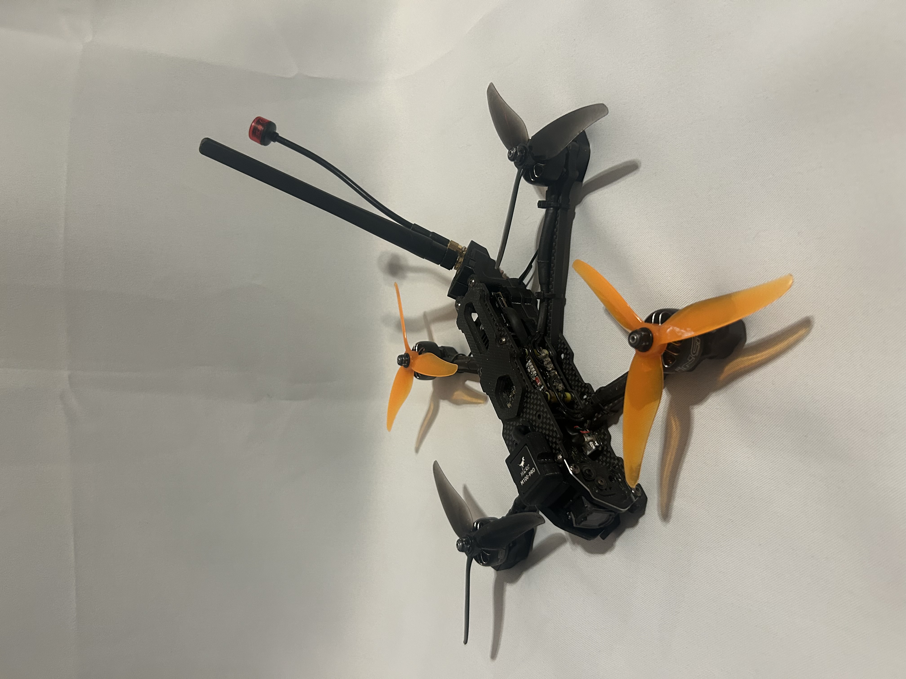
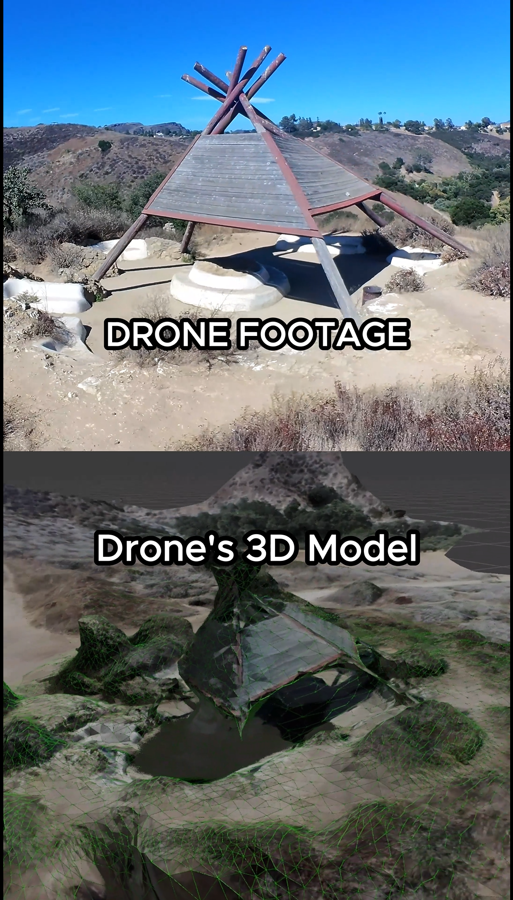

<p align="center">
  
</p>

<p align="center">
  <a href="media/3d-mapping-demo%20%282%29.mp4">
    
  </a>
</p>

<p align="center">
  <b>Click the image above to watch the drone footage to 3D model demo.</b>
</p>

# Self-Flying 3D Mapping Drone

<p align="center">
  
  
  
  
  
</p>

I built a self-flying 3D mapping drone.

The video shows the drone capturing footage around a subject using a planned circular flight path, then turning that footage into a 3D model.

The goal was to turn a custom long-range FPV drone into a platform that can fly planned GPS paths, collect aerial data, and generate 3D models from onboard footage.

Because the mission path is stored onboard the flight controller, the drone can follow the route without constant manual input, even if the live video feed or control link becomes limited by distance or obstacles.

The same idea can be used for mapping missions over buildings, streets, terrain, mountains, or hard-to-reach structures. Once the footage is turned into a 3D model, it can be inspected, analyzed, and used for measurements on a computer instead of only being watched as normal drone video.

## Project Overview

This is a 5-inch FPV drone build focused on GPS-based flight, long-range capability, and 3D reconstruction from captured footage.

The drone is built around a SpeedyBee F405 V5 stack running ArduPilot. It uses a GPS and magnetometer for navigation, a digital FPV camera system for onboard footage, and custom 3D-printed mounts for the GPS and antennas.

Main capabilities:

- FPV flight
- GPS-based position hold
- Altitude hold
- Loiter mode
- Waypoint missions
- Circular flight paths around a subject
- Return-to-home behavior
- Long-range video/control setup
- Onboard footage capture
- Photogrammetry-based 3D model generation

## Hardware Used

Main components:

- 5-inch FPV drone frame
- SpeedyBee F405 V5 flight controller stack
- ArduPilot flight software
- HGLRC M100 Pro GPS and magnetometer
- DJI O4 Lite / Flywoo camera setup
- XR4 dual-band receiver
- Tri-band antenna setup
- Long TrueRC antenna with pigtail routing
- Separate beeper/buzzer
- Custom 3D-printed GPS and antenna mounts
- 6S battery setup
- Soldered power, signal, GPS, receiver, video, and accessory wiring

The goal of the hardware layout was to keep the GPS and antennas mounted cleanly away from interference while still keeping the drone compact enough for a 5-inch build.

## Flight Controller and ArduPilot Setup

The drone uses ArduPilot for GPS-based flight modes and mission control.

ArduPilot allows the drone to follow planned routes instead of only being controlled manually. This makes it useful for repeatable mapping flights where the drone needs to hold a consistent path, speed, altitude, and camera angle.

The mission can be planned before flight, loaded onto the flight controller, and then executed by the drone during the flight.

Supported flight behavior includes:

- Waypoint navigation
- Position hold
- Altitude hold
- Loiter
- Circular paths
- Return-to-home
- Mission continuation from onboard flight data

## GPS, Magnetometer, and Tuning

A major part of the project was getting the GPS-based flight modes working reliably.

The HGLRC M100 Pro GPS and magnetometer provide position and heading data to the flight controller. For loiter, waypoint missions, and circular flight paths to work well, the drone needs accurate sensor calibration and stable tuning.

Setup work included:

- GPS wiring
- Magnetometer setup
- Compass calibration
- Accelerometer calibration
- ArduPilot parameter tuning
- Flight mode testing
- Loiter tuning
- Position hold testing
- Return-to-home testing
- Circular path testing

Tuning was important because GPS flight modes are only useful if the drone can hold position and follow the planned path smoothly.

## 3D Mapping Workflow

Manual flying can change speed, height, camera angle, image overlap, and signal reliability. All of these can affect the quality of the final 3D model.

Using planned flight paths makes the capture more repeatable. The drone can fly around the subject at a more consistent altitude, distance, and camera angle, which helps the photogrammetry software build a better reconstruction.

Basic mapping process:

```txt
Planned GPS flight path
  → Drone captures onboard footage
  → Video frames are extracted
  → Frames are processed in photogrammetry software
  → Software generates a 3D reconstruction
  → Model can be inspected and analyzed on a computer
```

## Photogrammetry

For the 3D model, I used onboard drone footage, extracted frames from the video, and processed them with photogrammetry software.

The software compares overlapping images from different angles and reconstructs the shape of the scene in 3D.

This is not survey-grade mapping yet, but it is a working early version of the full pipeline:

```txt
Self-flying drone mission
  → Aerial video capture
  → Frame extraction
  → 3D reconstruction
  → Visual model inspection
```

## Why This Matters

Normal drone footage is useful, but it is still just video.

A 3D model is more useful because it can be:

- Rotated
- Inspected
- Measured
- Compared
- Used for documentation
- Viewed on a computer after the flight

This could be useful for mapping buildings, terrain, structures, trails, hard-to-reach areas, or anything that benefits from being captured as a 3D scene instead of only as video.

## Custom 3D-Printed Parts

I designed and printed custom parts to mount and organize the drone hardware.

3D-printed parts included:

- GPS mount
- Antenna mount
- Receiver/antenna routing support
- Camera or accessory mounting support

These parts helped keep the GPS and antennas positioned better for signal quality while keeping the build cleaner and more secure.

## Current Status

This is an early working version of the drone mapping platform.

Completed so far:

- 5-inch drone assembled
- SpeedyBee F405 V5 stack installed
- GPS and magnetometer installed
- DJI O4 Lite / Flywoo camera system installed
- Receiver and antenna setup installed
- ArduPilot configured
- GPS-based modes tested
- Circular flight path tested
- Drone footage captured
- Footage processed into a 3D model

## Future Improvements

Planned improvements:

- Improve GPS tuning
- Improve loiter accuracy
- Improve circular flight smoothness
- Capture higher-quality footage
- Improve image overlap for cleaner 3D models
- Add detailed wiring diagrams
- Add full parts list
- Add flight logs and test notes
- Add more 3D model examples
- Improve documentation for anyone trying to build something similar

## Media

Current media in this repository:

```txt
media/
  drone-build.jpg
  3d-mapping-demo-cover.png
  3d-mapping-demo (2).mp4
```

The demo video shows the drone footage on top and the generated 3D model on the bottom.

## Notes

This project is still being developed and improved. The current version proves the main idea: a custom FPV drone can fly a planned GPS mapping path, capture onboard footage, and turn that footage into a visual 3D reconstruction.
